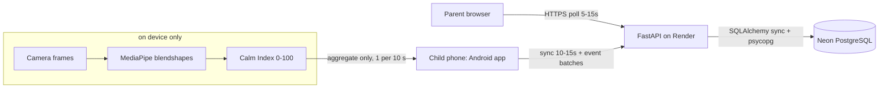
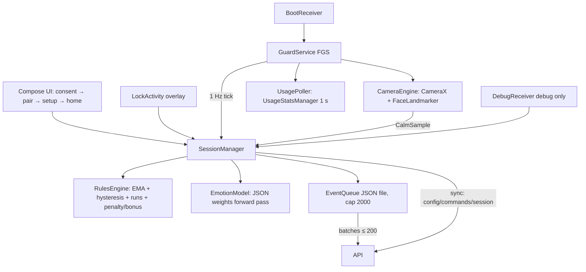

# Architecture

> Binding specifications live in `docs/spec/`. This chapter describes what was built
> (lean edition). Generated diagrams: see the Mermaid blocks below; the ER diagram is
> generated by `scripts/gen_er.py` from the SQLAlchemy metadata (Phase 2 models).

## Context (DFD-0)

**Privacy invariant (File 01 §E8):** camera frames never leave the device and are never
written to disk; only the aggregated Calm Index, daily app totals and ledger events are
uploaded. No biometric templates are stored.

## Level 1 (child app modules)

## Data model

Generated ER diagram: `docs/er.mermaid` (via `scripts/gen_er.py` from the SQLAlchemy
metadata — deterministic). Paste into any Mermaid renderer.

Ten lean tables (LEAN §1.2): `parents`, `children` (settings JSONB),
`pairing_codes`, `devices` (partial-unique active per child), `screen_sessions`
(pending/active/cooldown/expired/ended), `emotion_events`, `ledger_events`
(both `UNIQUE(child_id, client_uuid)` for idempotency), `app_usage_daily`
(unique child+date+package, max upsert), `alerts` (dedupe_key unique), `commands`
(24 h TTL). UUID PKs generated in Python; UTC everywhere.

## Deployment view

See `docs/DEPLOYMENT.md` — one Docker image on Render serves the SPA + API; Neon Postgres
(pooled, sslmode=require) behind it; schema via `create_all()`.

## ML contract

`contracts/feature_spec.json` fixes the blendshape names/order and the `.task` SHA-256;
`ml/artifacts/emotion_model.json` (≤ 20 KB) ships to the app as an asset;
`contracts/classifier_vectors.json` pins `p` (±1e-4) and exact `ci` for the Kotlin parity
test (blocked on H3 until the model is trained).

## Rules engine (device-authoritative)

File 01 §E4 minus nudge/bedtime (LEAN §1.2): per-tick delta capped 5 s, EMA 0.2,
hysteresis (stressed enter <35 / leave ≥40; calm enter ≥70 / leave <65), runs with 10 s
reset and >120 s no-signal reset, penalty → 5-min cooldown (time not consumed) → bonus with
per-session cap, low-time notices, expiry at 0. Defined by 17 pure-Kotlin unit tests
(`RulesEngineTest`) — LEAN §1.2 replaced the golden-vector suite with these.
